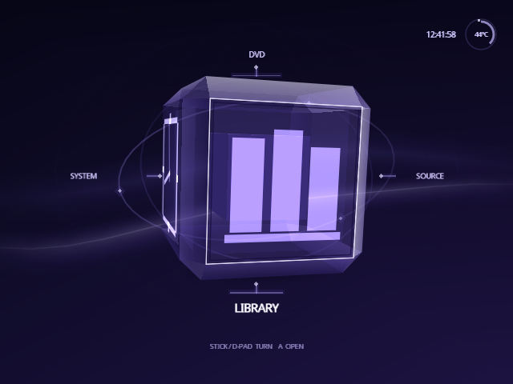
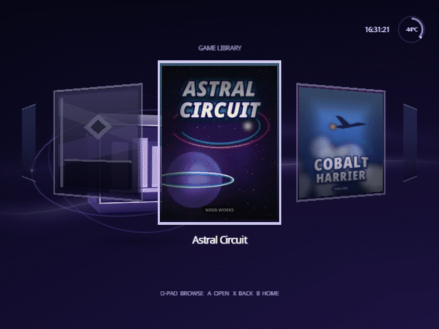
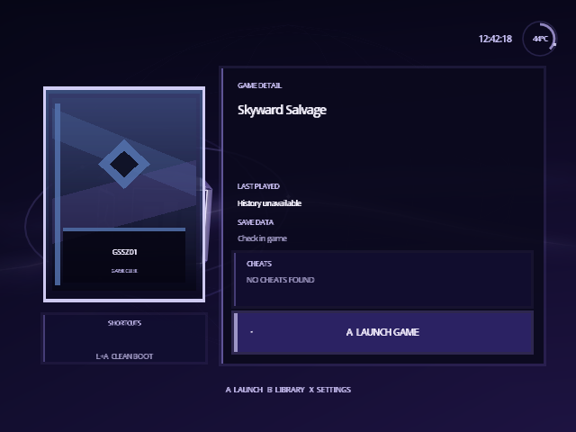

<h1 align="center">Swiss UI</h1>

<p align="center">
  <strong>A fork of Swiss for the Nintendo GameCube with the interface rebuilt.</strong><br>
  An animated Home, a poster library and game details, drawn in the console's own visual language.
</p>

<p align="center">
  <a href="https://norvitech.com"></a>
  <a href="https://github.com/spencercnorton/swiss-ui/tags"></a>
  <a href="#install"></a>
  <a href="LICENSE"></a>
  <a href="https://buy.stripe.com/8x26oH2U44f65TRe574wM04"></a>
</p>

<p align="center">
  
</p>

Captured on a demonstration card: the game titles and cover art are fictitious.

Swiss UI is an unofficial fork of [Swiss](https://github.com/emukidid/swiss-gc),
the homebrew utility that boots and patches games on a Nintendo GameCube. The
fork changes one thing: what you look at. Everything underneath — the device
handlers, the patch engine, the loader — is upstream's work, and this fork
does not try to improve it. It is for people who use Swiss daily on real
hardware and want it to feel like it belongs on the console.

## What it does

**Home is an animated cube.** Four faces, one destination each, rotating in
both axes, with device state carried through the turn instead of redrawn
after it. The GameCube's own interface language — the idle cube, the
typeface, the palette — is the reference, not a desktop launcher.

**The library retains its posters.** A grid over whatever device you booted
from, with artwork kept across navigation rather than re-read per frame, and
your selection restored when you come back from a game's details. Cover art
comes from a pack you build yourself; without one, each game gets a generated
card.

<p align="center">
  
</p>

**Game details are a surface, not a dialogue.** Artwork, last played, save
data, cheats and the boot options for that title in one place, with the same
controller grammar as every other screen.

<p align="center">
  
</p>

**Cheats read clearly.** The cheat browser shows per-cheat state plainly, and
the runtime handling around it is stricter about what it will apply.

**Settings and System were rebuilt to match.** Consistent navigation,
consistent focus, and no screen that still looks like the old list.

## Install

### Any platform — from source

The build runs in the same container image the project's CI uses, so no
toolchain is installed on your machine:

```bash
git clone https://github.com/spencercnorton/swiss-ui.git
cd swiss-ui
docker run --rm -u "$(id -u):$(id -g)" -v "$PWD:/work" -w /work \
  ghcr.io/extremscorner/libogc2 make dev
# cube/swiss/swiss.dol
```

Copy `cube/swiss/swiss.dol` to your SD card as your loader expects it — the
same path you already use for Swiss. There is no published binary release and
no installer; this is a source fork of a homebrew utility.

The release packaging targets (`make dist` and friends) are not supported
here: they need prebuilt tools and device firmware images that this fork does
not redistribute. `make dev` builds the executable, which is what the fork
changes.

## Documentation

- [`CHANGELOG.md`](CHANGELOG.md) — what each release contains.
- [`NOTICE`](NOTICE) — upstream provenance and the third-party components in this tree.
- [`docs/screenshots/`](docs/screenshots) — the pictures above, captured from a demonstration card.
- Upstream [Swiss documentation](https://github.com/emukidid/swiss-gc) covers every device handler, patch and boot option; none of it changed here.

## Contributing and support

- Bugs and feature requests: [open an issue](https://github.com/spencercnorton/swiss-ui/issues/new/choose). Questions: [Discussions](https://github.com/spencercnorton/swiss-ui/discussions). Do not report fork issues to the upstream project.
- Security reports: [private vulnerability reporting](https://github.com/spencercnorton/swiss-ui/security/advisories/new) — see [SECURITY.md](SECURITY.md). There is no e-mail address; that is deliberate.
- Pull requests are welcome; read [CONTRIBUTING.md](CONTRIBUTING.md) first — this repository is a release mirror, and accepted changes ship in the next tagged release.
- If Swiss UI saves you time, you can [support its development](https://buy.stripe.com/8x26oH2U44f65TRe574wM04).

## Development

```bash
docker run --rm -u "$(id -u):$(id -g)" -v "$PWD:/work" -w /work \
  ghcr.io/extremscorner/libogc2 make dev      # what CI builds
buildtools/check_whitespace.sh
```

## Licence

[GPL-2.0-or-later](LICENSE) © Spencer Norton

Swiss UI is a modified version of [Swiss](https://github.com/emukidid/swiss-gc)
(© emukidid and the Swiss contributors, GPL-2.0-or-later) and inherits that
licence. Provenance, the modified surface and the third-party components in
this tree are recorded in [`NOTICE`](NOTICE). This fork is unofficial and is
not endorsed by or affiliated with the Swiss project.

---

<p align="center">
  <a href="https://norvitech.com"></a>
</p>

<p align="center">
  <a href="https://github.com/spencercnorton/helios">Helios</a> ·
  <a href="https://github.com/spencercnorton/bitagent">BitAgent</a> ·
  <a href="https://github.com/spencercnorton/xnote">XNote</a> ·
  <a href="https://github.com/spencercnorton/xnote-placement">XNote Placement</a> ·
  <a href="https://github.com/spencercnorton/snipsnap">SnipSnap</a> ·
  <a href="https://github.com/spencercnorton/swiss-ui">Swiss UI</a> ·
  <a href="https://norvitech.com">norvitech.com</a>
</p>
